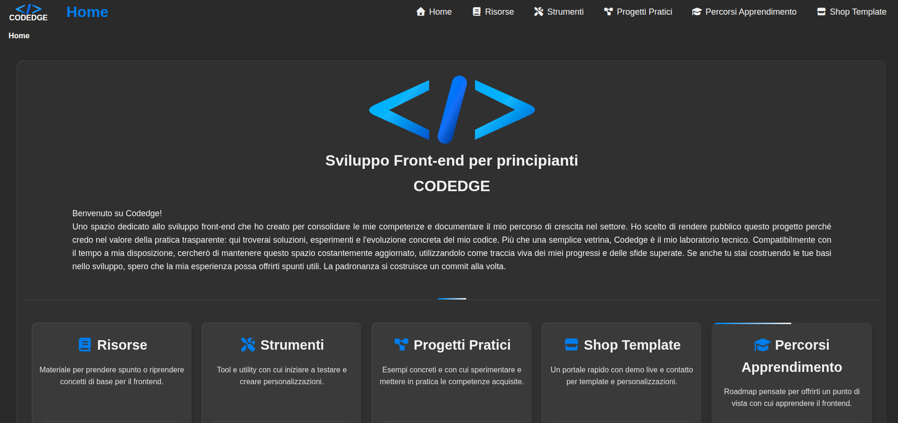

# CODEDGE

Sito: [https://codedge.it](https://codedge.it)



## Cos'e questo sito
Codedge e il mio spazio personale dove studio, provo e pubblico front-end.
Non e una vetrina perfetta: e un laboratorio pratico fatto di test, errori, miglioramenti e codice reale.
Lo uso anche come raccoglitore dei progetti che realizzo: una home contenitore per cercare un ordine mentale e non perdere la bussola durante il percorso.

## Chi sono
Mi chiamo Alessandro.
Sono autodidatta, appassionato di IT, e ho scelto il front-end come percorso principale.
Questo progetto nasce per mettere in pratica quello che studio e per tracciare i miei progressi nel tempo.

## Cosa trovi dentro
- `Risorse`: glossari HTML/CSS/JS e snippet pronti da usare.
- `Strumenti`: generatori colori, gradienti, box-shadow, compressore immagini, estrattore palette.
- `Progetti pratici`: mini progetti ed esempi interattivi (scroll indicator, card, navbar, form, ecc.).
- `Shop Template`: demo live, collegamento allo shop Etsy e pagina per richieste di personalizzazione.
- `Percorsi apprendimento`: contenuti piu teorici e roadmap (sezione in crescita).
- Pagine utili: contatti, chi sono, privacy policy, termini di servizio.

## Stato del progetto
Questo sito e in continuo mutamento.
Lo miglioro e lo aggiorno quando trovo tempo, aggiungendo nuove idee, sistemando dettagli e rendendo tutto piu solido passo dopo passo.

## Stack
- HTML
- CSS
- JavaScript
- Vite
- Deploy su GitHub Pages

## Avvio locale
```bash
npm install
npm run dev
```

## Build
```bash
npm run build
npm run preview
```
