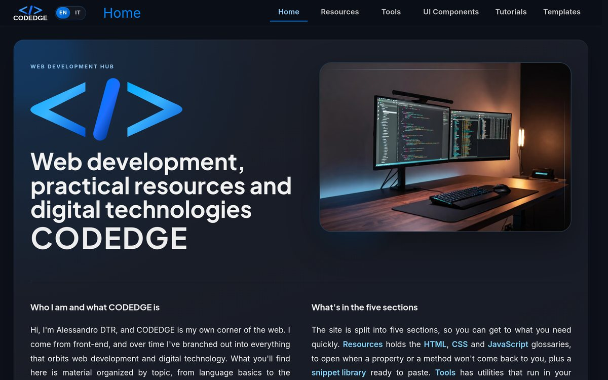

# CODEDGE

[](https://github.com/aledtr77/codedge/actions/workflows/deploy.yml)
[-3fb950)](tests/)
[](LICENSE)

Source of **[codedge.it](https://codedge.it)** — a bilingual front-end reference site,
written by hand. No framework, no CMS, no bought theme underneath.

[](https://codedge.it)

## What's on it

- **Glossaries** — 418 entries across HTML, CSS and JavaScript, to open when a property
  or a method won't come back to you
- **Tutorials** — 12 practical guides: Git and GitHub, browser DevTools, accessibility,
  deployment, technical SEO, developing with AI, and the fundamentals of the three
  languages
- **Tools** — four utilities that run entirely in the browser: colour and gradient
  generators, an image compressor, a palette extractor
- **UI components** — four components with the full commented source, plus a snippet
  library ready to paste
- **Templates** — live demos of the portfolio projects, with a link to the Etsy shop

## How it's built

Plain HTML, CSS and JavaScript, assembled with Vite into a multi-page static site.
Built on GitHub Actions, deployed to Cloudflare Pages.

A few things worth pointing at, because they're the parts that took the work:

- **The tools never upload anything.** Compress an image and the file stays on your
  machine — there is no request that could carry it anywhere.
- **Accessibility is written in, not bolted on.** Components ship with their ARIA
  attributes and keyboard focus handling from the start.
- **The two languages are kept in sync by a script**, not by memory. It flags a page
  when it changes on one side only. English lives at the root, Italian under `/it/`.
- **The logic that runs without a DOM is tested, and the tests block the deploy.**
  Colour conversion and quantisation, the route map the hreflang tags and the 301s
  come out of, the Italian-in-English detector, the runtime UI strings.
- **What only exists in a browser is checked in one, in CI, and blocks too.**
  After the build, a headless Chrome opens the pages in `dist/` — what ships — and
  fails the deploy if one of them never produces a contentful paint, if a module
  throws or a request 404s, if the guide needs JavaScript before it will lay out,
  if the language lever stops swapping in place, or if the palette extractor and
  the glossary search stop doing their one job. Every one of those got past a
  green build once already.

## Run it locally

```bash
npm install
npm run dev         # dev server
npm test            # unit tests (Vitest)
npm run lint        # ESLint
npm run build       # static output in dist/
npm run test:smoke  # drives a headless Chrome over dist/ — needs the build first
npm run preview     # serve the build
```

## Licence

**The code is MIT** — see [LICENSE](LICENSE). HTML structure, CSS, JavaScript, build
configuration and scripts: take them, read them, reuse them.

**The editorial material is not**, and that split matters — see
[CONTENT-LICENSE.md](CONTENT-LICENSE.md). Glossary entries, tutorials, article text,
quiz questions, images and the Codedge brand are all rights reserved. Quote a passage
with attribution and a link if it's useful to you; don't republish the material in bulk
somewhere else.

## Contact

**contatti.codedge@gmail.com** · [codedge.it/contact](https://codedge.it/contact/)
